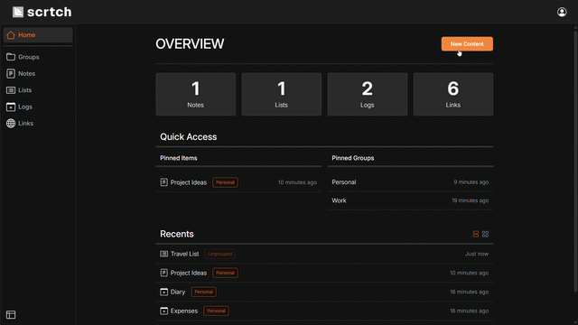

<p align="center">
    <picture>
        <source media="(prefers-color-scheme: dark)" srcset=".github/assets/scrtch-logo-dark.svg">
        <source media="(prefers-color-scheme: light)" srcset=".github/assets/scrtch-logo-light.svg">
        
  </picture>
</p>
<p align="center" title="Do you have a scratch paper?">
    <i>"May scratch paper ka?"</i>
</p>

# scrtch

A minimal, secure, and personal scratchpad app for note-taking.


[Live Demo](https://scrtch.pages.dev)

## Overview

**scrtch** (short for "scratchpad" or "scratch paper") came from a simple need, a place to write something down and move on, similar to using a piece of paper or Notepad. This is an app to jot down notes, organize bits of information, keep daily logs, and save links without all the extra features found in most note-taking apps.

### Features

- **Quick Scratch**: An accessible scratchpad area for temporary notes without requiring login.
- **Dashboard**: A central place to organize personal notes, structured lists, and daily logs.
- **Grouping**: Group together similar notes, lists, and logs to keep topics separated.
- **Links Manager**: Save, organize, and quickly open links.
- **Authentication**: User accounts and auth flows powered by Supabase, keeping data private per user.
- **Responsive Layout**: Minimalist UI that works across desktop and mobile screens.

<p align="center">
    
</p>

## Architecture Overview

**scrtch** is built as a pure client-side SPA. There is no custom backend server or custom API layer. The React frontend interacts directly with Supabase for data persistence, authentication, and database security via the official `@supabase/supabase-js` client library.

### Frontend

- **React**: UI library for building the components and views.
- **TypeScript**: Type safety across application data, state, and API responses.
- **Vite**: Build tool and local development server.
- **Tailwind CSS**: Utility-first CSS framework for layout and styling.
- **TanStack Query**: Data fetching, caching, and server-state management.

### Backend and Database

- **Supabase**: Backend-as-a-Service (BaaS) providing PostgreSQL, authentication, and auto-generated REST APIs.
- **Row Level Security**: Database-level security policies written in PostgreSQL to enforce data privacy per authenticated user without custom backend logic.
- **Supabase JS Client**: Handles data querying and authentication sessions directly from the React app.

## Local Development Setup

### Prerequisites

- [**Node.js**](https://nodejs.org/en/download): Version 20.19+ or 22.12+
- **Package Manager**: `yarn` (recommended to match `yarn.lock`) or `npm`
- **Supabase Project**: A Supabase project to host your database and authentication service.

### Setup

**1. Clone the repository**

Download the project code to your local machine.

```bash
git clone https://github.com/JC-Xevasty/scrtch.git
```

**2. Install dependencies**

Install all required project packages.

```bash
# Using Yarn (recommended)
yarn install

# Or using npm
npm install
```

**3. Configure Environment Variables**

Create a local environment file in the root directory named `.env`.

Copy and paste the contents from the file `.env.example` or run the command:

```bash
cp .env.example .env
```

Open the `.env` file and fill in your Supabase project credentials.

- `VITE_SUPABASE_URL`: Replace `<project_id>` with your Supabase project ID (found under Project Settings -> General).
- `VITE_SUPABASE_ANON_KEY`: Your Supabase Publishable Key (found under Project Settings -> API Keys -> Publishable key).
- `VITE_ALLOW_REGISTRATION`: Set to `true` to allow new user signups, or `false` to disable signups.

**4. Run the Local Development Server**

Start the Vite development server.

```bash
# Using Yarn
yarn run dev

# Or using npm
npm run dev
```

Open your browser and navigate to the local URL shown in your terminal (usually `http://localhost:5173`).

## Database Setup & Security

### Database Initialization

Before running the application, you need to execute the SQL scripts in your Supabase project to set up tables, triggers, and automated timestamps.

1. Find the SQL script files under `supabase/migrations/`.

2. In the Supabase Dashboard, go to SQL Editor.

3. Run the `_up_script.sql` files sequentially in order from `00` to `03`.
    - `00_automated_updated_at_setter_up_script.sql`: Sets up trigger functions for automatic timestamp updates (`updated_at`).
    - `01_profiles_up_script.sql`: Creates user profile table and initial user data structures.
    - `02_content_tables_up_script.sql`: Creates core tables for notes, lists, logs, links, and groups. Sets up indexes, access, Row Level Security (RLS), and policies.
    - `03_content_functions_triggers_up_script.sql`: Applies triggers and procedural logic across content tables.

> Note: The corresponding `_down_script.sql` files are provided to revert or drop tables if needed.

### Supabase Authentication Configuration

In your Supabase Dashboard, navigate to **Authentication** -> **Sign In / Providers** -> **Email** and configure the following settings:

- **Enable Email Provider**: ON
- **Secure Email Change**: ON
- **Require current password when updating**: ON

### Security & Data Privacy (Row Level Security)

- **Row Level Security (RLS)**: Enabled across all database tables storing user data (defined in `02_content_tables_up_script.sql`).
- **Access Control**: RLS policies restrict operations so users can only access records they are authorized to access based on their authenticated user ID (defined in `02_content_tables_up_script.sql`).
- **Registration Control**: User signups can be toggled on or off using the `VITE_ALLOW_REGISTRATION` environment variable.

## Deployment Guide

### Host-Agnostic Deployment

Since **scrtch** is built as a static client-side SPA, it can be deployed to most static hosting services. The build process creates optimized HTML, JS, and CSS files that connect directly to your Supabase instance.

### Build Command & Output Directory

Regardless of where you deploy, configure your build settings with:

- **Build Command**: `yarn run build` (or `npm run build`)
- **Output Directory**: `dist`

### Environment Variables

Make sure to add your production environment variables in your hosting provider's settings panel before building:

- **VITE_SUPABASE_URL**: Your Supabase Project URL
- **VITE_SUPABASE_ANON_KEY**: Your Supabase Publishable Key
- **VITE_ALLOW_REGISTRATION**: `true` or `false`

### SPA Routing Note

Because this is a single-page application using client-side routing, configure your host to rewrite all incoming routes to `index.html` so direct page refreshes don't result in 404 errors.

### Platform Setup Guides

Refer to official deployment documentation for popular static hosting platforms:

- **Cloudflare Pages**: [Vite deployment guide](https://developers.cloudflare.com/pages/framework-guides/deploy-a-vite3-project/)
- **Vercel**: [Vite on Vercel](https://vercel.com/docs/frameworks/frontend/vite)
- **Netlify**: [Vite on Netlify](https://docs.netlify.com/build/frameworks/framework-setup-guides/vite/#deploy-a-vite-site-on-netlify)
